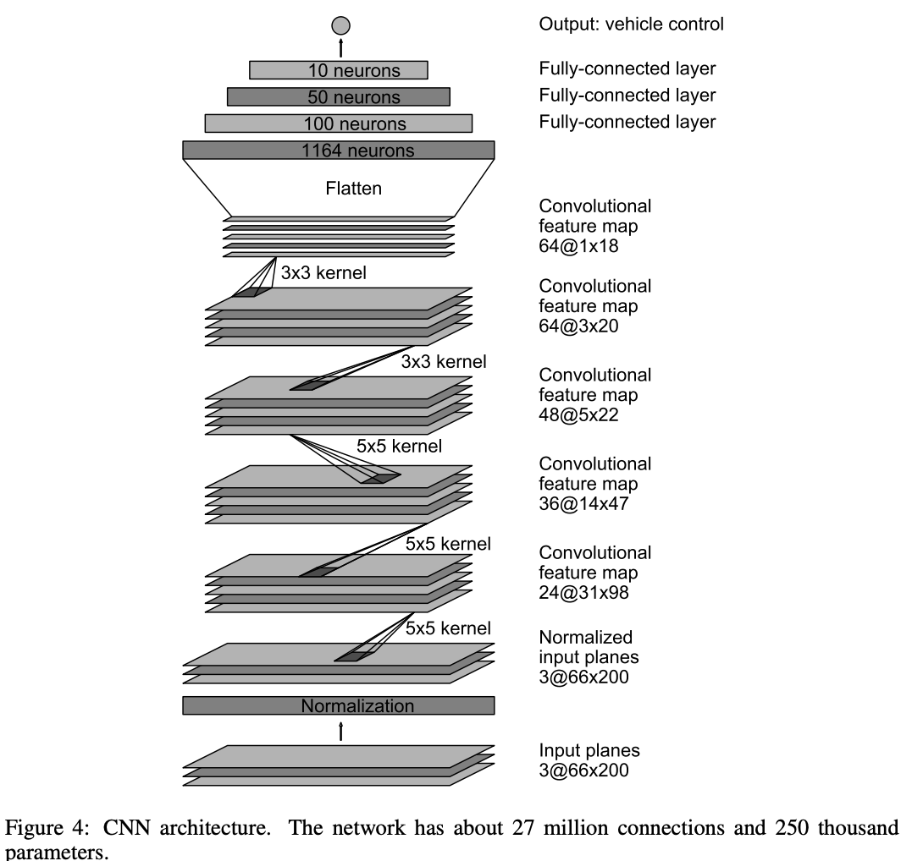

# Self-Driving-Car-Behaviour-Cloning
Dataset captured in Udacity term-I v1 simulator in six laps, 3 laps in each direction of track to balance the data in terms of steering angle.

# Model created based on NVIDIA research paper
https://images.nvidia.com/content/tegra/automotive/images/2016/solutions/pdf/end-to-end-dl-using-px.pdf

# Declaration/ Credits:
Udacity Simulator - https://github.com/udacity/self-driving-car-sim

Approach to the problem statement is inspired by course
The Complete Self-Driving Car Course - Applied Deep Learning on Udemy, Created by Rayan Slim.
https://www.udemy.com/course/applied-deep-learningtm-the-complete-self-driving-car-course/
